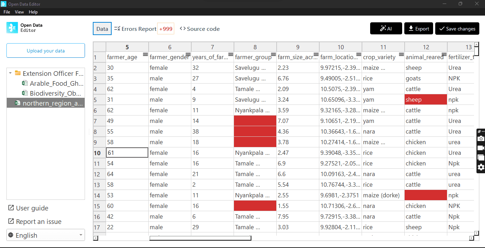

## Agricultural data (Ghana)

Open Science Community Ghana (OSCG) used ODE to streamline the work with manually-collected data and reduce the time to identify and correct errors. 

The ODE interface enabled the team to easily define and enforce a standard data structure, ensuring that every dataset adheres to a consistent format. This directly solved their core problem of harmonising the data that they receive from different sources.

An example of errors detected by ODE in a research dataset: blank cells and wrong formats.

Learn more: [https://blog.okfn.org/2025/11/10/open-data-editor-in-action-bridging-the-gap-between-field-data-and-research-insights-in-ghana/](https://blog.okfn.org/2025/11/10/open-data-editor-in-action-bridging-the-gap-between-field-data-and-research-insights-in-ghana/) 