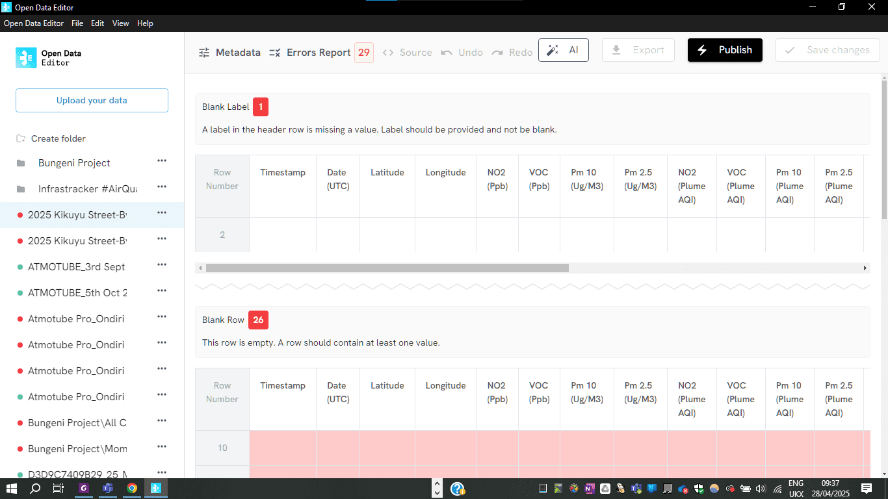

## Climate data (Kenya)

The Demography Project used ODE to check and correct errors in a giant spreadsheet of air quality data, enabling accurate analysis.

These tables, which compile data from different sources (including two portable air quality monitors, GPS devices, smartphones), had many inconsistencies that were detected in seconds. Once the errors have been identified, they could then correct the missing or incorrect data, increasing the dataset’s quality.

In this spreadsheet, ODE identified 29 inconsistencies and errors in the dataset.

Learn more: [https://blog.okfn.org/2025/04/28/open-data-editor-use-case-a-giant-spreadsheet-of-environmental-data-now-accurate-for-analysis/](https://blog.okfn.org/2025/04/28/open-data-editor-use-case-a-giant-spreadsheet-of-environmental-data-now-accurate-for-analysis/)