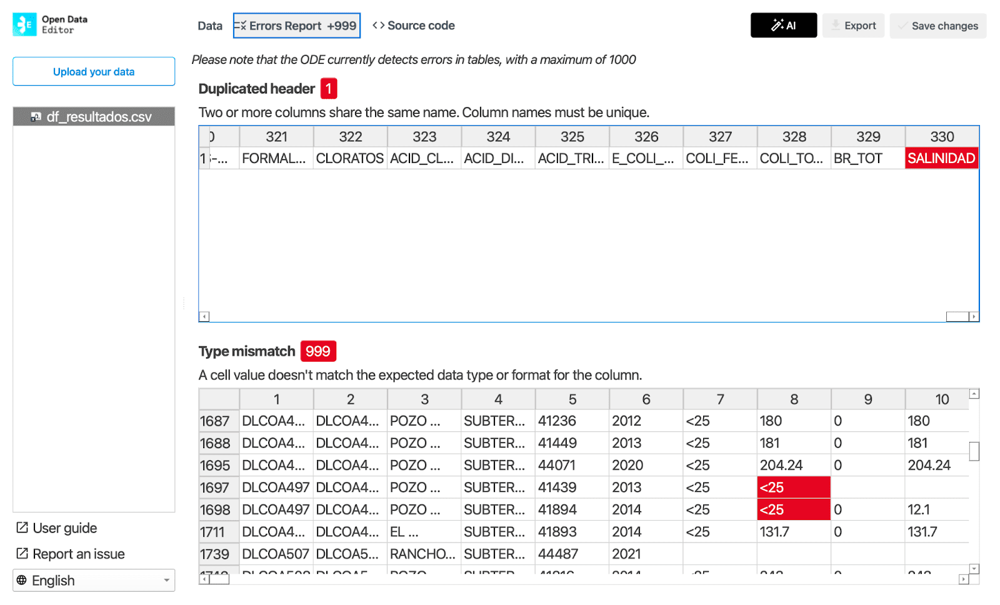

## Data journalism (Mexico)

Data Crítica used ODE to identify reliable variables for journalistic investigations and ensure stories are built on a solid foundation.

They used it as a central part of its “data interrogation” methodology in workshops and its own research. ODE instantly flagged missing values, providing a clear, visual overview of a dataset’s completeness by highlighting empty cells.

In the same dataset as the picture above, ODE now identifies errors in columns with the same name and unexpected data types

Learn more: [https://blog.okfn.org/2025/11/28/open-data-editor-in-action-interrogating-data-for-investigative-journalism-in-mexico/](https://blog.okfn.org/2025/11/28/open-data-editor-in-action-interrogating-data-for-investigative-journalism-in-mexico/)