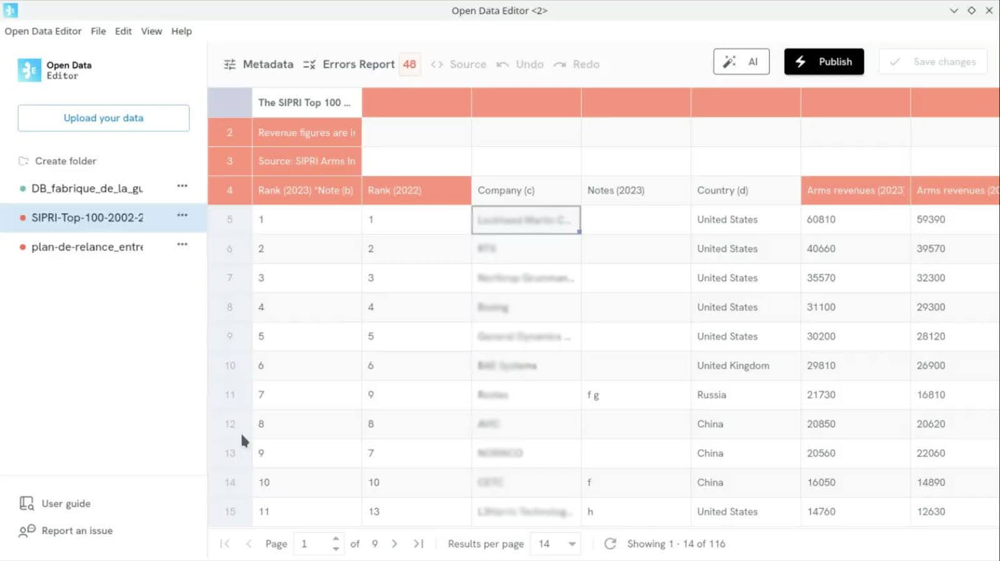

## Defence data (France)

The Observatoire des armements used ODE to turn multiple public spending data sources (arms purchases and sales) into a single quality spreadsheet.

They reduced error resolution time from days to seconds, eliminated 95% of manual review work, and enabled the team to focus on what matters. 

In this spreadsheet, ODE flagged 48 inconsistencies in seconds.

Learn more: [https://blog.okfn.org/2025/04/14/open-data-editor-use-case-multiple-defence-spending-data-sources-in-a-single-quality-spreadsheet/](https://blog.okfn.org/2025/04/14/open-data-editor-use-case-multiple-defence-spending-data-sources-in-a-single-quality-spreadsheet/)