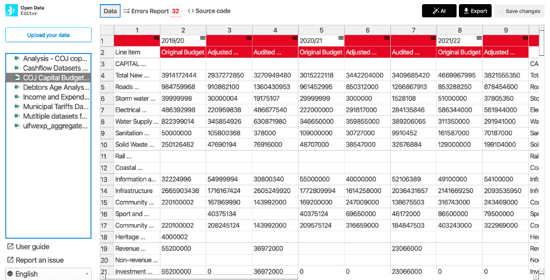

## Financial data (South Africa)

The Public Affairs Research Institute (PARI) used ODE to restructure messy public financial datasets into a clean, consistent format, making them ready for reliable analysis.

ODE automatically profiled the data, instantly highlighting empty cells, type mismatches, and structural inconsistencies that would take days to find manually. This shifted their role from manual detectives to efficient data supervisors.

Examples of errors detected by ODE in a municipal dataset: blank cells and wrong formats.

Learn more: [https://blog.okfn.org/2025/11/10/open-data-editor-in-action-enhancing-fiscal-governance-and-transparency-in-south-african-municipalities/](https://blog.okfn.org/2025/11/10/open-data-editor-in-action-enhancing-fiscal-governance-and-transparency-in-south-african-municipalities/)
