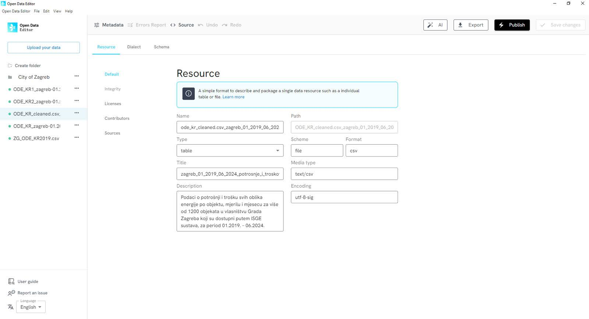

## Government data (Croatia)

The City of Zagreb used ODE to comply with open data standards and foster a culture of data literacy across different city offices in Zagreb.

ODE flagged inconsistencies (e.g., missing values, formatting errors) in seconds, such as a public buildings dataset with 11 columns of unlabeled energy metrics. The team was able to add critical context (e.g., data owners, sourcing methods) directly in ODE’s metadata panel, aligning with FAIR principles.

ODE’s metadata panel was central to understanding the importance of interoperability and creating a culture of data literacy in the public administration.

Learn more: [https://blog.okfn.org/2025/05/20/open-data-editor-in-action-streamlining-data-governance-and-unlocking-the-potential-value-of-urban-data-in-croatia/](https://blog.okfn.org/2025/05/20/open-data-editor-in-action-streamlining-data-governance-and-unlocking-the-potential-value-of-urban-data-in-croatia/) 