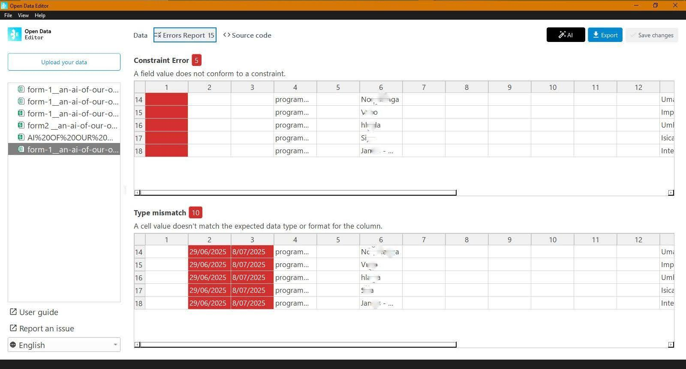

## Heritage data (Cambodia)

An AI of Our Own (AAOO) used ODE to create AI models that are built on respectful and ethically sourced data from the Global South.

ODE allowed the team to identify and rectify formatting inconsistencies. They could standardise date formats and other variables, ensuring that data from different collection methods could be seamlessly unified. A critical feature for AAOO was the ability to add detailed descriptions to each column. This process of adding context and meaning to each data point is fundamental to building a high-quality, culturally nuanced AI dataset.

Errors flagged showing data inconsistency from the converted unstructured data into a structured format without considering the standard format and time stamps (Data on Indigenous Knowledge Systems on Plant use)

Learn more: [https://blog.okfn.org/2025/11/05/open-data-editor-in-action-building-culturally-accurate-and-global-south-sensitive-ai-datasets/](https://blog.okfn.org/2025/11/05/open-data-editor-in-action-building-culturally-accurate-and-global-south-sensitive-ai-datasets/) 