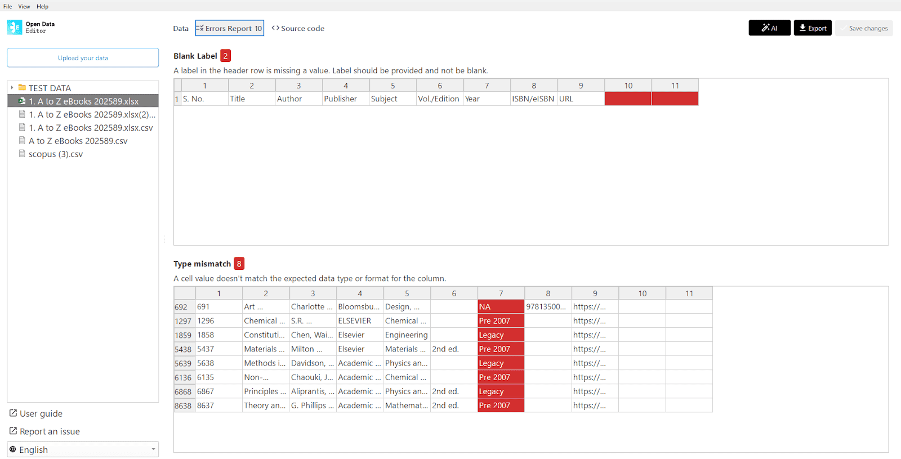

## Library data (India)

The Indian Institute of Technology (IIT) Delhi used ODE to check errors in large spreadsheets of publications catalogue and educate colleagues about data quality.

ODE automatically flagged a range of issues in complex datasets, including bibliographic information from major indexes like Scopus and Web of Science. By identifying formatting inconsistencies, ODE provided a foundation for the team to clean and standardise fields, creating more reliable datasets for their reports and website.

Open Data Editor helps automate error detection; above, problems with blank cells and the data types expected for a given column.

Learn more: [https://blog.okfn.org/2025/12/09/open-data-editor-in-action-advancing-data-quality-in-academic-library-services-in-india/](https://blog.okfn.org/2025/12/09/open-data-editor-in-action-advancing-data-quality-in-academic-library-services-in-india/) 