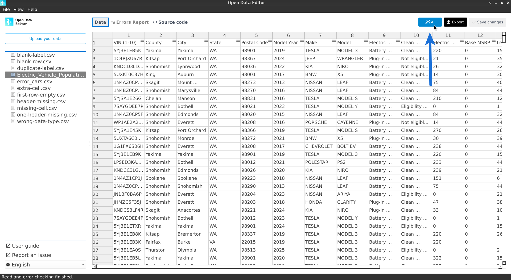
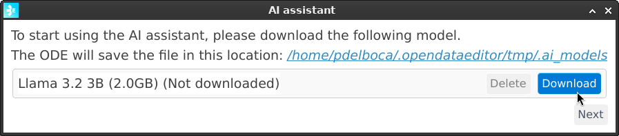
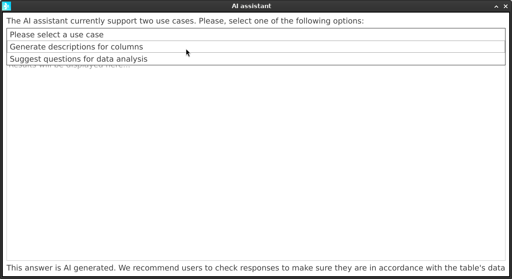
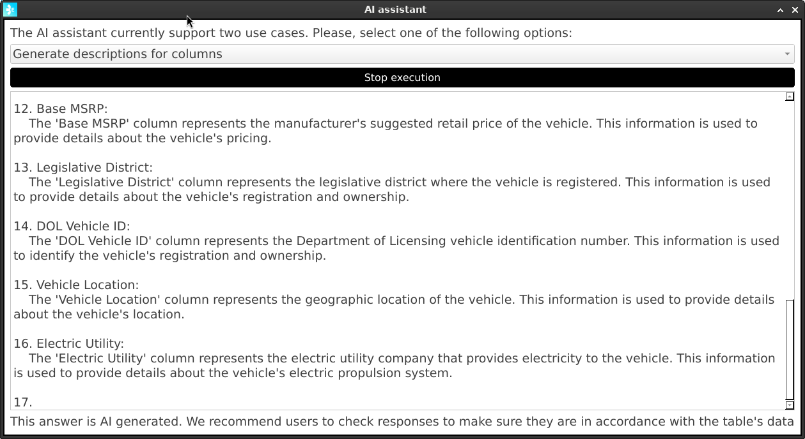
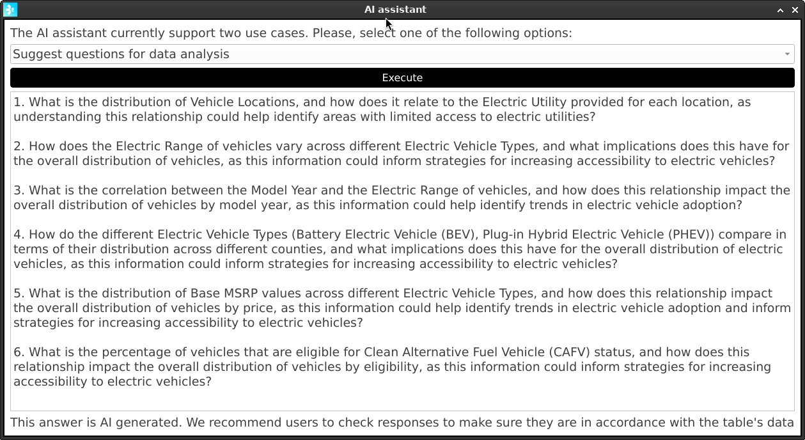

## How to use the AI component

To use the AI assistant, select a file from the sidebar, and then click on the **AI** button located in the top right corner of the app:

ODE will show a dialogue to assist the user in downloading the model:

Once the model is downloaded, users will be able to click on the **Next** button to continue.

### AI Use Cases

ODE has two use cases for the AI component:

1. Assist users in understanding the columns of a table.  
2. Suggest analysis and questions that users can use to query the data.

To choose the use case, select it from the dropdown menu.

Once selected, click on the **Execute** button to get a response from the AI model.

:::{note}
Depending on the hardware of the users’ machines, the response time can vary. Usually, it will take around 10 seconds to get a response. :::

#### Assist users in understanding the columns of a table

The AI model will analyse the columns’ names, types and some sample data and will generate a description of each column. This is useful to understand the data better, clarify technical or complex names, expand acronyms, etc.

#### Suggest analysis and questions that users can use to query the data

The AI model will analyse the columns’ names, types and some sample data and will generate a list of questions that the user can use to query the data.

