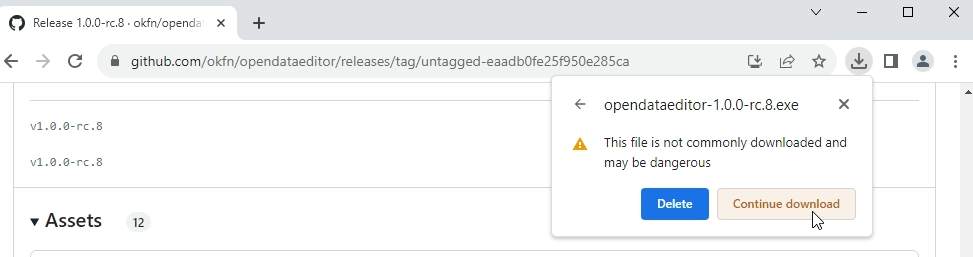
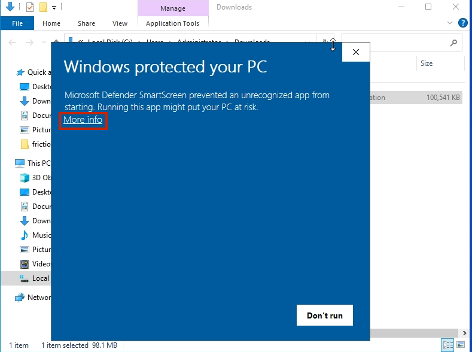
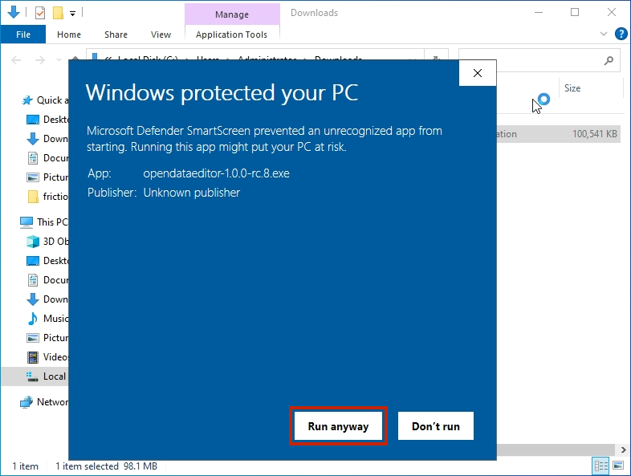
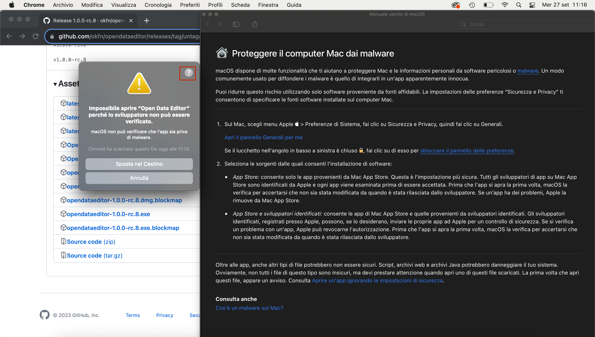
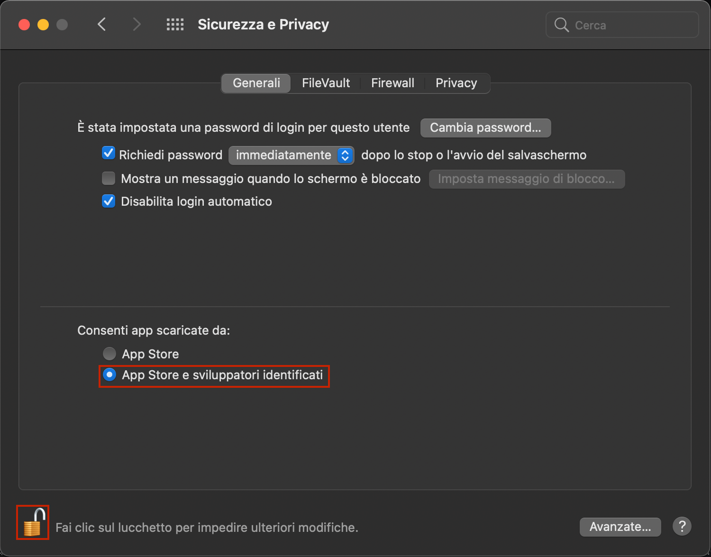
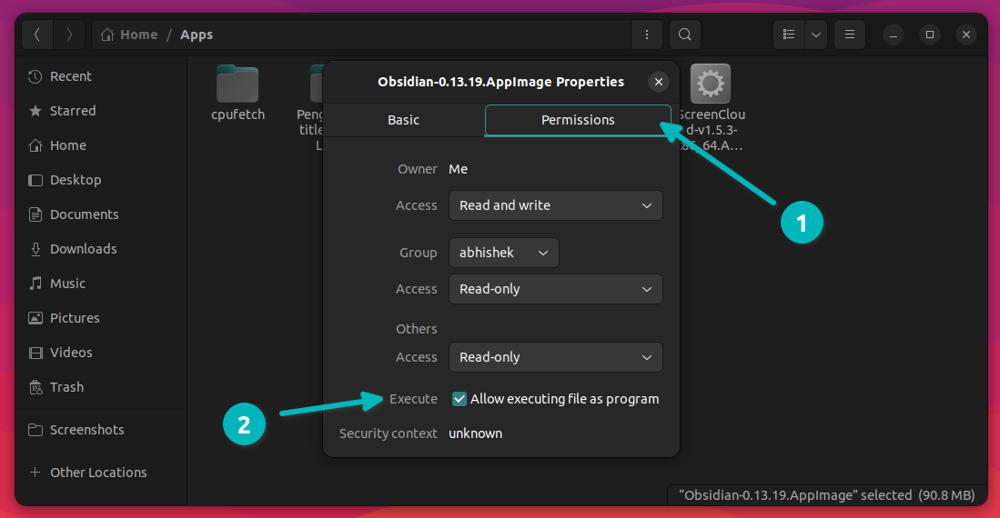
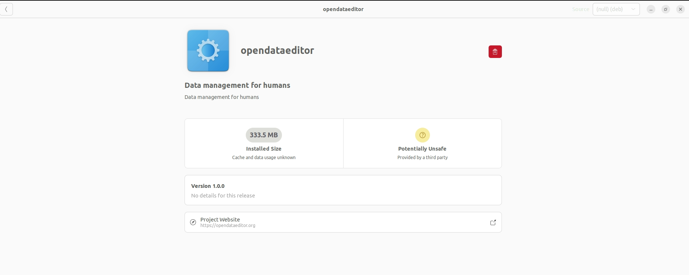
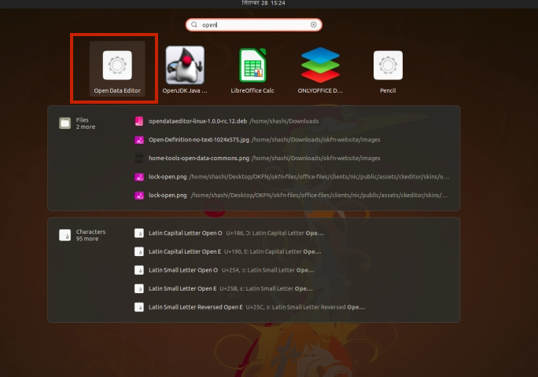

## Installing ODE

### Windows

Download the most recent **EXE** file as per the above instructions.

1\. If you receive the following message, click ‘Continue download’.

2\. After downloading, double-click to run the app. You may encounter the security message window, click ‘More info’ and proceed.

3\. Click ‘Run anyway’ to run the application.

### MacOS

Download the most recent **DMG** file as per the above instructions.

1\. If you encounter a security message, click on the question mark and then click the link in the first section.

2\. Change settings to allow the app to execute.

### Linux

For Linux, there are two options available:

* AppImage (for any distributions)  
* deb (for Ubuntu/Debian)

#### Any Distribution

Download the most recent **AppImage** file as per the above instructions.

After downloading, you have to make it executable:

Then double-click on the file to start the application.

#### Ubuntu/Debian

Download the most recent **DEB** file as per the above instructions.

Double-click on the file, and it will initiate the installation process.

After installation, you can use it.

Optionally, in Debian, you can install it by running the following command:

*\# Replace \<version\> with the version you downloaded*  
sudo dpkg \-i opendataeditor-linux-\<version\>.deb